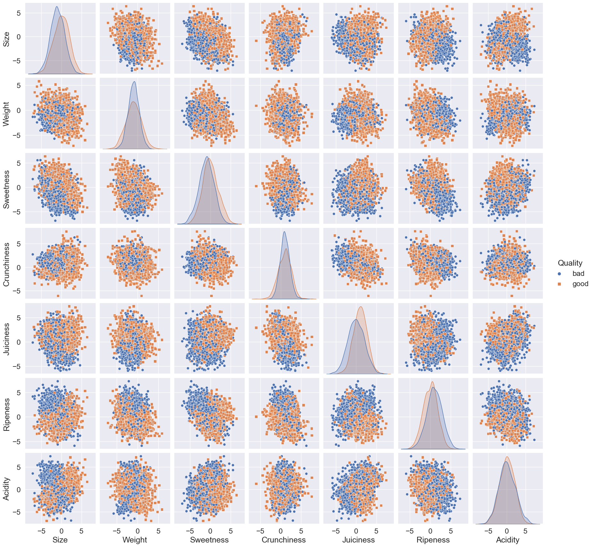
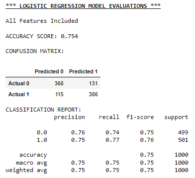
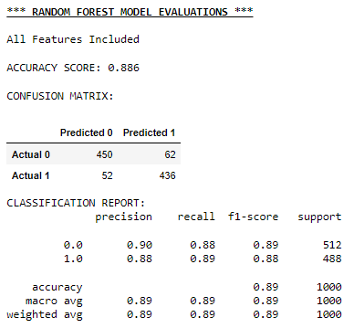
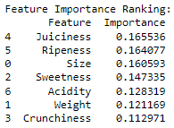
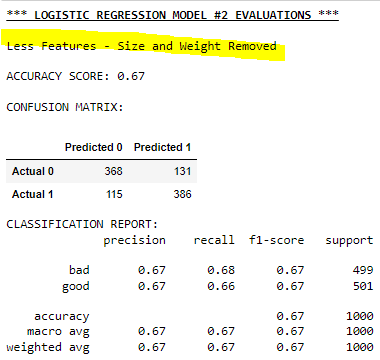
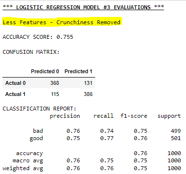

# Project4_AppleQualityPredictions
Project 4 Apple Quality ML Predictions

Entry level machine learning practice for Project 4

Data Source : Apple Quality csv file from Kaggle.com

Outline:

    TOOLS - Python Pandas, Python Matplotlib, Python Seaborn, Sqlite3, Scikit-Learn

    MODELS - Logistic Regression, Random Forest

    ETL -

        Extract Data:
            Apple Quality CSV from Kaggle.com
            4000+ rows
            9 columns ; A_id, Size, Weight, Sweetness, Crunchiness, Juiciness,Ripeness, Acidity, and Quality
        
        Transform Data:
            Cleaning –Missing Values
            Conversion –Data Types
            Selection –Column Removal

        Loading Data:
            Load SQLite Database
            Execute SQL Query
            Retrieve SQLite Database to DataFrame.
            Visualization -Seaborn’s Pairplot

    DATA VISUALIZATION - 
            

    LOGISTIC REGRESSION MODEL
            
                
            
    RANDOM FOREST MODEL
        
                
                
    
    LOGISTIC REGRESSION MODEL OPTIMIZATION
            
                
                

            

